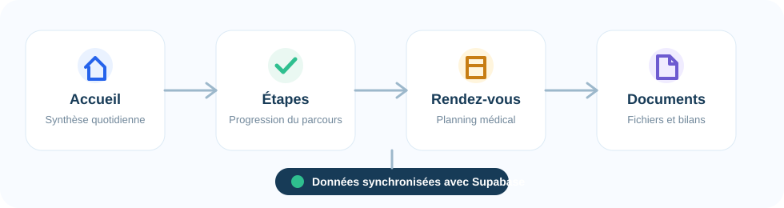

<p align="center">
  
</p>

<h1 align="center">Meditrack</h1>

<p align="center">
  Application web de suivi du parcours chirurgical, pensée pour rendre chaque étape plus claire, plus accessible et plus simple à consulter.
</p>

<p align="center">
  
  
  
  
  
</p>

## Vue D'ensemble

Meditrack accompagne les utilisateurs dans les différentes étapes avant, pendant et après une intervention chirurgicale. Le projet met l'accent sur une interface lisible, des interactions accessibles et une organisation simple des informations importantes.

L'application est structurée en deux parties:

- `frontend`: interface Vue.js avec Vite.
- `backend`: API Node.js avec Express.
- `Supabase`: base de données, stockage et services associés.

<p align="center">
  
</p>

## Fonctionnalités

| Module        | Description                                                                                                |
| ------------- | ---------------------------------------------------------------------------------------------------------- |
| Accueil       | Vue synthétique du prochain rendez-vous, des tâches du jour et des documents récents.                      |
| Étapes        | Suivi des grandes phases du parcours chirurgical avec progression étape par étape.                         |
| Rendez-vous   | Consultation, historique et ajout de rendez-vous médicaux.                                                 |
| Documents     | Gestion des documents utiles au parcours: comptes rendus, ordonnances, bilans et documents administratifs. |
| Accessibilité | Navigation par onglets, libellés ARIA, focus clavier et structure pensée pour la lecture assistée.         |

## Stack Technique

| Couche         | Technologie             |
| -------------- | ----------------------- |
| Frontend       | Vue 3, Vite             |
| Backend        | Node.js, Express        |
| Données        | Supabase                |
| Qualité        | ESLint                  |
| Gestion projet | Scripts npm à la racine |

## Structure

```text
Meditrack/
├── backend/              # API Express
│   ├── api/              # Routes / handlers API
│   ├── server.js         # Point d'entrée backend
│   └── package.json
├── frontend/             # Application Vue/Vite
│   ├── src/
│   │   ├── components/   # Modules UI
│   │   ├── layout/       # Navigation
│   │   └── lib/          # Client Supabase
│   └── package.json
├── api/                  # Fonction serverless Vercel pour l'API Express
├── docs/assets/          # Illustrations du README
├── .github/workflows/    # Pipeline CI/CD GitHub Actions
├── Makefile              # Commandes de dev, qualité et redémarrage
├── scripts/dev.sh        # Lancement backend + frontend
├── vercel.json           # Configuration de déploiement Vercel
└── package.json          # Scripts globaux
```

## Prérequis

- Node.js `^20.19.0` ou `>=22.12.0`
- npm
- Un projet Supabase configuré

## Variables D'environnement

Des fichiers `.env_exemple` sont disponibles dans `backend` et `frontend`.

`backend/.env`

```env
VITE_SUPABASE_URL=https://xyz.supabase.co
VITE_SUPABASE_PUBLISHABLE_KEY=your_publishable_key
SUPABASE_SERVICE_ROLE_KEY=your_service_role_key
DOCUMENT_ENCRYPTION_KEY=your_64_hex_chars_key
```

`frontend/.env`

```env
VITE_API_URL=http://localhost:3000
VITE_SUPABASE_URL=https://xyz.supabase.co
VITE_SUPABASE_ANON=your_anon_key
```

Les fichiers `.env` ne doivent pas être commit. Ils sont ignorés par Git.

## Déploiement Vercel

Le projet contient deux configurations Vercel:

- `vercel.json`: build du frontend Vite pour le projet Vercel `meditrack`.
- `backend/vercel.json`: déploiement serverless Express pour le projet Vercel
  `meditrack-back`.

Le frontend et le backend étant déployés dans deux projets Vercel séparés,
`VITE_API_URL` doit pointer vers l'URL publique de `meditrack-back`.

Le projet Vercel `meditrack` doit utiliser `frontend` comme root directory.

Variables à configurer dans Vercel:

Projet frontend `meditrack`:

```env
VITE_SUPABASE_URL=https://xyz.supabase.co
VITE_SUPABASE_ANON=your_anon_key
VITE_API_URL=https://meditrack-back.vercel.app
```

Projet backend `meditrack-back`:

```env
VITE_SUPABASE_URL=https://xyz.supabase.co
VITE_SUPABASE_PUBLISHABLE_KEY=your_publishable_key
SUPABASE_SERVICE_ROLE_KEY=your_service_role_key
DOCUMENT_ENCRYPTION_KEY=your_64_hex_chars_key
CORS_ORIGIN=https://meditrack.vercel.app
```

## Installation

Depuis la racine du projet:

```bash
npm run setup
```

Cette commande installe les dépendances du backend et du frontend.

## Démarrage

Pour mettre à jour les dépendances puis lancer le backend et le frontend:

```bash
make start
```

Pour arrêter les services actifs sur les ports du projet puis les relancer:

```bash
make restart
```

Pour installer les dépendances puis lancer le projet en une seule commande:

```bash
npm run setup:start
```

Pour lancer le projet quand les dépendances sont déjà installées:

```bash
npm start
```

Le backend démarre sur:

```text
http://localhost:3000
```

Le frontend démarre sur l'URL indiquée par Vite, généralement:

```text
http://localhost:5173
```

Si le port `5173` est déjà utilisé, Vite choisit automatiquement le port suivant disponible.

## Commandes Utiles

| Commande                 | Rôle                                                               |
| ------------------------ | ------------------------------------------------------------------ |
| `make start`             | Met à jour les dépendances puis lance backend et frontend.         |
| `make restart`           | Arrête les ports `3000` et `5173`, puis relance le projet.         |
| `make quality`           | Formate le code, applique ESLint, puis vérifie ESLint et Prettier. |
| `make test`              | Lance les tests automatisés du backend.                            |
| `make precommit`         | Lance la qualité du code puis les tests avant de commit.           |
| `npm run setup`          | Installe les dépendances backend et frontend.                      |
| `npm run setup:start`    | Installe les dépendances puis démarre le projet.                   |
| `npm start`              | Lance backend et frontend ensemble.                                |
| `npm run start:backend`  | Lance uniquement l'API Express.                                    |
| `npm run start:frontend` | Lance uniquement l'application Vue/Vite.                           |
| `npm test`               | Lance les tests backend depuis la racine.                          |
| `npm run build`          | Génère le build de production du frontend.                         |
| `npm run format`         | Applique Prettier sur les fichiers pris en charge.                 |
| `npm run check-format`   | Vérifie le formatage Prettier sans modifier les fichiers.          |
| `npm run lint`           | Exécute ESLint sur le projet.                                      |
| `npm run lint:fix`       | Applique automatiquement les corrections ESLint disponibles.       |

Avant un commit, la commande recommandée est:

```bash
make precommit
```

## CI/CD

Le projet contient une pipeline GitHub Actions dans
`.github/workflows/ci-cd.yml`.

Elle se déclenche sur:

- les pull requests vers `main`;
- les pushes sur `main`;
- les tags qui commencent par `v`, par exemple `v1.0.0`.

La pipeline exécute les étapes suivantes:

1. Installation propre avec `npm ci` à la racine, dans `backend` et dans
   `frontend`.
2. Vérification Prettier avec `npm run check-format`.
3. Vérification ESLint avec `npm run lint`.
4. Tests automatisés backend avec `npm test`.
5. Build frontend avec `npm run build`.

Les tags `v*` déclenchent aussi une release GitHub, uniquement si le commit taggé
appartient bien à `main` et si toute la quality gate passe.

Exemple de release:

```bash
git checkout main
git pull origin main
make precommit
git tag -a v1.0.0 -m "Release v1.0.0"
git push origin v1.0.0
```

## Développement

Le backend peut être lancé seul depuis `backend`:

```bash
npm install
npm start
```

Le frontend peut être lancé seul depuis `frontend`:

```bash
npm install
npm run dev
```

## Estimation des coûts

Estimation mensuelle pour exploiter Meditrack en production, basée sur trois paliers d'utilisateurs.

**Hypothèses communes :**

- Stockage moyen par patient : ~7 documents × 3 Mo ≈ 21 Mo
- Base de données : ~200 Ko par utilisateur (profils, RDV, tâches, étapes)
- Vercel Pro
- Domaine `.fr` ou `.com`

### Hypothèse 1 — Stack par défaut

| Poste            | 1 000 utilisateurs | 5 000 utilisateurs | 10 000 utilisateurs |
| ---------------- | ------------------ | ------------------ | ------------------- |
| Nom de domaine   | ~1 €/mois          | ~1 €/mois          | ~1 €/mois           |
| Supabase Pro     | 25 $/mois          | ~26 $/mois         | ~28 $/mois          |
| Vercel Pro       | 20 $/mois          | 20 $/mois          | 20 $/mois           |
| **Total estimé** | **~46 $/mois**     | **~47 $/mois**     | **~49 $/mois**      |

Le principal facteur de coût dans ce palier est le **stockage des documents chiffrés** (Supabase Storage). Le plan Pro Supabase inclut 100 Go ; au-delà, chaque Go supplémentaire coûte 0,021 $/Go.

> Au-delà de 10 000 utilisateurs, prévoir une montée en compute Supabase (+50 $/mois pour le palier Medium) si les temps de réponse se dégradent.

### Hypothèse 2 — Conformité HDS (données de santé)

En France, l'**Article L. 1111-8 du Code de la Santé Publique** impose d'héberger les données de santé à caractère personnel chez un prestataire certifié **HDS** par l'ANS (Agence du Numérique en Santé). Ni Supabase ni Vercel ne sont certifiés HDS : cette hypothèse remplace les composants concernés par **Scaleway** (certifié HDS depuis 2024, sélectionné pour le Health Data Hub français).

**Changements d'infrastructure :**

| Composant         | Stack par défaut      | Stack HDS                              |
| ----------------- | --------------------- | -------------------------------------- |
| Base de données   | Supabase (PostgreSQL) | Scaleway Managed PostgreSQL (HDS)      |
| Stockage fichiers | Supabase Storage      | Scaleway Object Storage (HDS)          |
| API backend       | Vercel Serverless     | Scaleway Instance / Container (HDS)    |
| Frontend          | Vercel Pro            | Vercel Pro _(inchangé — SPA statique)_ |

**Estimation mensuelle (Scaleway HDS + Vercel frontend) :**

| Poste                 | 1 000 utilisateurs | 5 000 utilisateurs | 10 000 utilisateurs |
| --------------------- | ------------------ | ------------------ | ------------------- |
| Nom de domaine        | ~1 €/mois          | ~1 €/mois          | ~1 €/mois           |
| PostgreSQL HDS        | ~25 €/mois         | ~25 €/mois         | ~55 €/mois          |
| Stockage HDS          | ~1 €/mois          | ~2 €/mois          | ~3 €/mois           |
| Backend HDS           | ~12 €/mois         | ~20 €/mois         | ~35 €/mois          |
| Frontend (Vercel Pro) | ~18 €/mois         | ~18 €/mois         | ~18 €/mois          |
| **Total estimé**      | **~57 €/mois**     | **~66 €/mois**     | **~112 €/mois**     |

> Le passage à un hébergement HDS représente un surcoût de ×1,2 à ×2,3 selon le palier. Ce coût est non-négociable pour une mise en production légale en France.

## Notes

- Le backend utilise `backend/server.js` comme point d'entrée.
- Le frontend lit les variables commençant par `VITE_`.
- Le projet est organisé pour garder une séparation claire entre interface, API et services Supabase.
